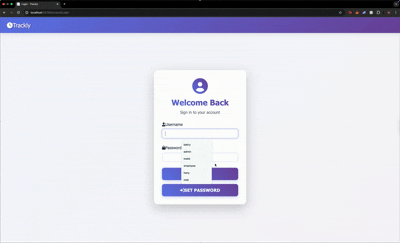

# 🕒 Trackly

**Trackly** is an ASP.NET Core web application for time tracking and scheduling. It offers role-based access for employees and administrators, allowing efficient management of work hours, tasks, and schedules.

## 📚 Table of Contents

- [✨ Features](#-features)
- [🛠 Tech Stack](#-tech-stack)
- [⚙️ Run Locally](#️-run-locally)
- [📸 Demo](#-demo)
- [🗂 Folder Structure](#-folder-structure)
- [📄 License](#-license)
- [👨‍💻 Author](#-author)

---
## ✨ Features

- ✔️ ASP.NET Core MVC architecture
- ✔️ Razor Views for dynamic UI
- ✔️ Entity Framework Core for database operations
- ✔️ SQL Server integration
- ✔️ Form validation and model binding
- ✔️ Secure user authentication and role-based authorization
- ✔️ RESTful routing with clean URLs
- ✔️ Dependency Injection
- ✔️ Admin and Employee roles with custom dashboards


## 🛠 Tech Stack

- **Framework:** ASP.NET Core MVC
- **Language:** C#
- **Database:** SQL Server / LocalDB
- **ORM:** Entity Framework Core
- **Frontend:** Razor Pages, HTML, CSS, Bootstrap
- **IDE:** VS code


## ⚙️ Run Locally

### Prerequisites

- [.NET SDK](https://dotnet.microsoft.com/en-us/download)
- [Visual Studio](https://visualstudio.microsoft.com/)
- SQL Server or LocalDB


### Steps

Clone the project

```bash
  git clone https://github.com/xahmedhx/Trackly.git
```

Go to the project directory

```bash
  cd Trackly
```

Restore packages

```bash
  dotnet restore
```

Apply Migrations

```bash
 dotnet ef database update
```
Run the application

```bash
dotnet run
```
## 📸 Demo




## 🗂 Folder Structure

```bash
Trackly/
├── Controllers/        # C# MVC Controllers
├── Data/               # DB context
├── Migrations/         # Migrations        
├── Models/             # Entity and View Models
├── Views/              # Razor Views
│   └── Shared/         # Layouts and partials
├── wwwroot/            # Static files (CSS, JS, images)
├── appsettings.json    # App configuration
├── Program.cs
└── README.md
```
## 📄 License

This project is licensed under the [MIT](https://choosealicense.com/licenses/mit/)


## 👨‍💻 Authors

- [Ahmed hany](https://www.github.com/xahmedhx)

